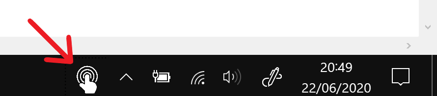
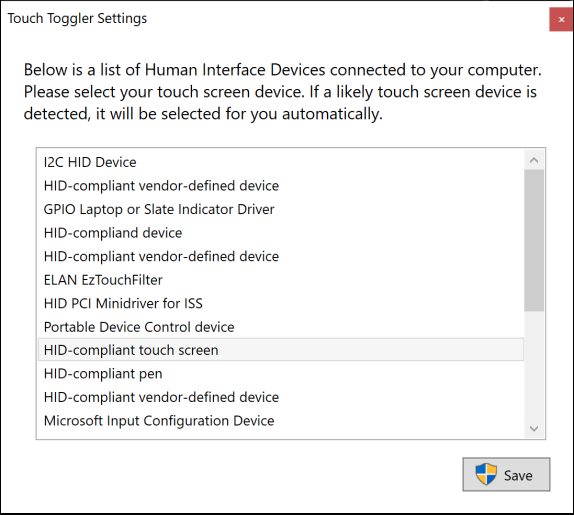

# Touch Toggler
Touch Toggler is a simple application that allows you to easily switch your touch screen on and off in Windows.
It installs an icon on the task bar which when clicked toggles the touch screen.

Touch enabled:

Touch disabled:

## How it works
The icon component is called a Desk Band. It runs within explorer to display itself as an icon in the task bar.
This communicates to a Windows service to enable and disable the touch screen hardware as that action requires higher privilages than the task bar will allow.

On initial startup the following screen will be presented to select which peice of hardware is the touch screen.
If a likely touch screen is found it will be pre-selected. The settings can be changed by right-clicking the task bar icon and selecting `Settings`.

## Why develop this?
I recently bought a new laptop with a touch screen and because the bezels are so thin (becoming more of a requirement in modern laptops), I was often acidentally closing applications when adjusting my screen angle.

Having looked extensively, there seems to be no simple solution to easily toggle the touch screen on/off. The only ways I found without requiring a restart were to create a batch file or to use Device Manager to enable/disable the hardware.
Windows 10's UI does not natively support toggling a touch screen.